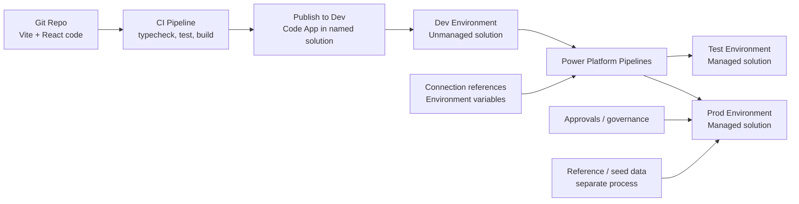

# ALM Process For This Code App

This document describes a production-ready ALM approach for this repository when deploying as a Power Apps Code App backed by Dataverse.

It covers:

- how to structure Dev, Test, and Prod
- how to deploy the code app into a solution
- how to promote changes with Power Platform Pipelines
- what pipelines do and do not deploy
- key Code Apps limitations to plan around

## Current Repo Context

This repo is a Vite React Code App intended to be published into Power Apps.

Relevant files:

- `power.config.json`
- `src/App.tsx`
- `src/hooks/use-sales-workspace.ts`
- `src/services/dataverse-sales-service.ts`

The current local build and publish shape is:

1. build the web app into `dist/`
2. publish the Code App to a Power Platform environment
3. run the app inside the Power Apps host
4. read and write Dataverse through the Power Apps runtime SDK

## Recommended Environment Model

Use three environments:

- `Dev`: direct publish from source control is allowed
- `Test`: receives managed solution deployments only
- `Prod`: receives managed solution deployments only

Recommended flow:

```text
Repo -> CI checks -> Push Code App to Dev solution -> Promote solution through Power Platform Pipelines -> Test -> Prod
```

## High-Level Deployment Model



## Core Principle

Treat the Code App as one component inside a solution-based Power Platform ALM process.

- Use direct push for `Dev`
- Use solution promotion for `Test` and `Prod`
- Avoid direct source-to-Prod pushes

## One-Time Setup

### 1. Create environments

Create:

- one Dev environment
- one Test environment
- one Prod environment

All target environments should have Dataverse enabled.

### 2. Create the solution

Create a non-default solution for this app, for example:

- `SalesPipelineSolution`

Do this once in the Dev environment. Reuse the same solution as the app evolves.

Recommended:

- set this solution as the preferred solution in Dev

Why:

- Code Apps ALM guidance explicitly recommends a non-default solution
- this keeps the app in a governed deployment container from day one

### 3. Create the Power Platform pipeline

Create a pipeline that promotes from:

- Dev -> Test
- Test -> Prod

Use approvals for Prod.

### 4. Configure deployment settings

If your app or related components use:

- connection references
- environment variables

configure those for each target stage before deployments start.

## Developer Workflow

### Local development

Develop locally and validate before deployment:

```powershell
npm ci
npm run typecheck
npm test
npm run build
```

### Publish to Dev

After local validation, publish the Code App into the Dev environment solution.

Current Microsoft guidance supports:

- `pac code push --solutionName <solutionName>`
- newer npm CLI flow with `npx power-apps push`

For this repo, the practical approach today is:

```powershell
npm run build
pac code push --solutionName SalesPipelineSolution
```

Notes:

- if the solution already exists, reuse it
- if the Code App is already in that solution, this updates the existing app in Dev
- do not create a brand-new solution per deployment

## Promotion Workflow

Once the Code App is in the Dev solution:

1. submit the solution through Power Platform Pipelines
2. deploy to Test
3. validate app behavior in Test
4. approve and deploy to Prod

This is the productionised route.

## What Happens If The Solution Already Exists

If the target environment already has the solution:

- keep using the same solution name
- do not create a replacement solution
- update the app inside that existing solution in Dev

If Test or Prod already has the solution because it was promoted previously:

- promote the next version of the same solution through pipelines
- do not bypass the process by directly pushing source code into Test or Prod

## CI/CD Design

Split the automation into two responsibilities.

### CI pipeline

Runs on pull requests and merges to main.

Suggested responsibilities:

- install dependencies
- typecheck
- run tests
- build production bundle

Example CI stages:

```text
Install -> Typecheck -> Test -> Build
```

### CD to Dev

Runs after merge to the main branch or from a controlled release branch.

Suggested responsibilities:

- authenticate to Power Platform
- build the app
- publish to the Dev solution

Example responsibilities:

```text
Authenticate -> Build -> Push Code App to Dev solution
```

### Promotion to Test and Prod

Handled through Power Platform Pipelines.

Suggested responsibilities:

- preflight dependency checks
- validate connection references
- validate environment variables
- approvals for higher stages
- managed deployment into Test and Prod

## Authentication And Identities

For automated deployments:

- use a service principal or controlled deployment identity
- avoid personal user accounts for pipeline deployments
- restrict direct Prod deployment permissions

For pipeline ownership:

- remember that deployed solution objects are owned by the deploying identity

## Data Considerations

Pipelines deploy:

- solutions
- connection references
- environment variables
- solution-contained Power Platform customizations

Pipelines do not deploy:

- Dataverse table data

That means:

- seed data
- reference data
- lookup records
- production master data

must be handled separately.

Possible approaches:

- controlled data migration scripts
- dataflows
- configuration tables populated per environment
- manual setup for small reference sets

## Code App Specific Considerations

Code Apps currently have important ALM limitations.

At the time of writing, Microsoft documents that Code Apps:

- do not support solution packager
- do not support source code integration

Implication:

- your Git repo remains the source of truth for code
- your solution remains the deployment artifact in Power Platform
- do not expect the classic full solution unpack/pack workflow used for some other Power Platform assets

## Recommended Operational Rules

### Do

- create and reuse one named solution
- publish directly only to Dev
- promote to Test and Prod through pipelines
- use approvals for Prod
- keep environment-specific configuration outside hard-coded app logic
- test Dataverse permissions in Test before Prod rollout

### Do not

- deploy from the default solution
- push directly from source control into Prod
- assume Dataverse data moves with the solution
- create a new solution for every deployment

## Repo-Specific Recommendation

For this repository:

- keep `power.config.json` aligned to the Dev environment for direct Dev publishing
- use the named solution in Dev as the handoff point to Power Platform Pipelines
- let Test and Prod receive only managed deployments through the pipeline path

## Suggested End-To-End Process

### First release

1. Create Dev, Test, and Prod environments
2. Create `SalesPipelineSolution` in Dev
3. Set it as preferred solution in Dev if possible
4. Build the app locally
5. Push the Code App into the Dev solution
6. Create and configure a Power Platform pipeline
7. Promote the solution to Test
8. Validate
9. Approve and promote to Prod

### Ongoing releases

1. Merge approved code to main
2. CI runs checks
3. CD publishes updated Code App to the Dev solution
4. Maker or release process promotes through Power Platform Pipelines
5. Validate in Test
6. Approve Prod deployment

## Useful Commands

### Local validation

```powershell
npm ci
npm run typecheck
npm test
npm run build
```

### Publish to Dev solution

```powershell
pac code push --solutionName SalesPipelineSolution
```

### Alternative newer CLI direction

```powershell
npx power-apps push
```

Use the newer npm CLI as Microsoft evolves Code Apps tooling, but keep the same ALM structure:

- push to Dev
- promote solutions through pipelines

## Official References

- ALM for Code Apps:
  `https://learn.microsoft.com/en-us/power-apps/developer/code-apps/how-to/alm`
- Power Platform Pipelines overview:
  `https://learn.microsoft.com/en-us/power-platform/alm/pipelines`
- Code Apps npm CLI quickstart:
  `https://learn.microsoft.com/en-us/power-apps/developer/code-apps/how-to/npm-quickstart`
- Environment variables overview:
  `https://learn.microsoft.com/en-us/power-apps/maker/data-platform/environmentvariables`

## Final Summary

The productionised model is:

- source control and CI for code quality
- direct Code App publish only into Dev
- solution-based promotion to Test and Prod
- separate handling for data

In short:

```text
Code -> Dev solution -> Power Platform Pipeline -> Test -> Prod
```
